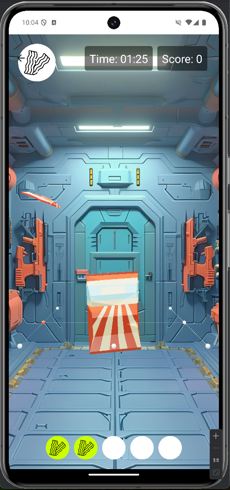
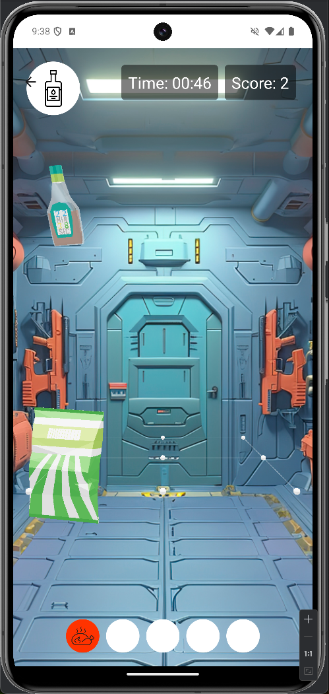
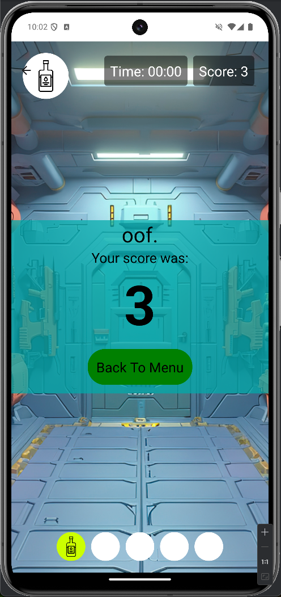

# Ready-Salted: The Game

*Prepare to get salty!*

In Ready Salted, you play as a plucky little bag of crisps, just trying to 
get some flavour & recognition from the Hungry Humans that come to eat you. 
The aim of the game is to catch the correct ingredients for your flavour of 
crisp, but be careful! Ingredients of the wrong flavour are also falling, 
and the Hungry Humans will not appreciate a bag of the wrong kind of crisps!

You have 5 crisps in your bag (you are a “fun size” packet). As ingredients 
fall, swipe up/down/left/right to move yourself under those ingredients! Try 
to catch ones that match your bag’s flavour, matched as follows:

- Ready Salted - A Salt Shaker
- Cheese & Onion- A Chunk of Mature Swiss Cheese
- Prawn Cocktail - A Prawn
- Roast Chicken - A Whole Chicken
- Smoky Bacon - A Rasher of Bacon
- Salt & Vinegar - A Bottle Of Vinegar

<div style="display: flex; justify-content: space-around; margin: 10px 0;">
    
    
    
</div>

As you catch ingredients, your crisps will get flavoured, which is shown on 
the bar on the bottom. Caught ingredients of the right type are highlighted 
in green, incorrect ones in red. At random, a Hungry Human will reach down 
to get a bag of crisps. This is your moment. Get yourself beneath the hand 
in time and you’ll get points, but be careful! You only get points for the 
crisps that have the flavour that matches your bag! Once your crisps have 
been eaten, you go on the search again. Then the cycle continues, forever, 
or until the timer stops, whichever is sooner.

This game is served by the back-end found here: 
https://github.com/141Soft/be-ready-salted


## Gameplay Footage
<a href="https://www.youtube.com/shorts/Z-Axyh7gLUw">https://www.youtube.com/shorts/Z-Axyh7gLUw</a>

## Developer Setup Notes

You will need to install android studio to develop this game. If you wish to 
use a physical device for development, you will not need the GUI and can 
just install adb.
After cloning this repository, run
```
npm install
npx expo start
```
and select the option given for your system (android, iOS, or web).
You will need to have a mobile development environment setup already if 
you're running this on android or iOS.

You may also find you need to run `npx expo start --tunnel` flag if you are 
using a physical device for development.


## Acknowledgements

This game was made as a final portfolio piece for the Northcoders software 
development bootcamp 
(https://northcoders.com/our-courses/skills-bootcamp-in-software-development).
We would like to thank our tutors & seminar leads for getting us to the 
point where we could make such an amazing thing.
We would also like to thank:
- Rakha Wibowo for their excellent YouTube tutorial & example project on 
  using React Native with three.js, which served as a basis for this 
  project.<br/>
  Link to their GitHub: https://github.com/Rakha112<br/>
  Link to their tutorial: https://www.youtube.com/watch?v=iRavet_Zau8
- The many artists who made the assets for the game, and who made their work 
  available. You can find specific attributions in `assets/ATTRIBUTIONS.md`.
- Microsoft Designer AI, for the AI art used to add artwork to the games.
